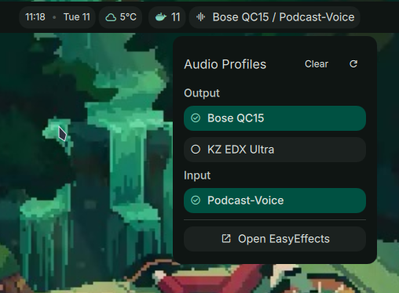

# Easy Effects Profile Switcher

Switch between [Easy Effects](https://github.com/wwmm/easyeffects) output and input audio profiles directly from the Noctalia bar.



## Features

- Bar widget showing active output/input profile at a glance
- Panel with separate output and input sections for quick switching
- Auto-detects currently active profiles on open
- Reload button to pick up newly added presets without restarting
- One-click reset to clear all active presets
- Launch Easy Effects directly from the panel

## Requirements

- [Easy Effects](https://github.com/wwmm/easyeffects) installed and running
- At least one output or input preset configured in Easy Effects

## Installation

Install via the Noctalia plugin registry:

```
https://raw.githubusercontent.com/gtheys/noctalia-unofficial-plugins/main/registry.json
```

Or manually copy the `easyeffects/` folder into your Noctalia plugins directory.

## Usage

| Action | Result |
|--------|--------|
| Click bar widget | Open profile panel |
| Click a profile | Activate it |
| Refresh icon | Reload preset list |
| Clear button | Reset all presets |
| Easy Effects button | Launch the app |

## Author

[gtheys](https://github.com/gtheys)

## Credits

Inspired by [dms-easyeffects](https://github.com/jonkristian/dms-easyeffects) by [jonkristian](https://github.com/jonkristian).

## License

MIT
